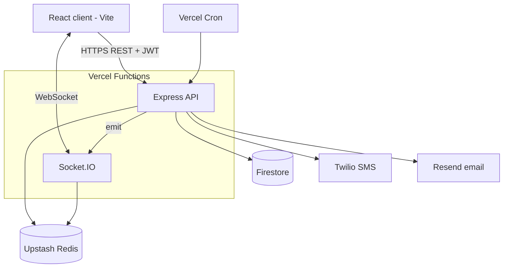

# Architecture

## Overview

One Vercel project, one domain. The React app is served as static files; `/api/*` and the Socket.IO path are rewritten to a single Express function. A shared domain lets the httpOnly refresh-token cookie work without third-party-cookie issues.



| Component | Responsibility |
| --- | --- |
| React client | UI, optimistic updates, token refresh interceptor, socket client (`transports: ['websocket']`) |
| Express API | Validation, auth, authorization, business logic, writes |
| Socket.IO | Authenticated connections, rooms, chat events, broadcasts after writes |
| Firestore | Source of truth for all persistent data |
| Upstash Redis | Socket.IO adapter across instances, presence, rate-limit counters |
| Twilio / Resend | Owner SMS codes / employee invites, email codes, notifications |
| Vercel Cron | Hourly due-date reminder job |

## Request lifecycle (mutations)

```
request → helmet/CORS → rateLimit? → requireAuth → requireRole? → validate(zod)
        → controller → mutate(): authorize ownership → Firestore transaction (data + activity)
        → emit to rooms → response
```

Sockets only notify. A client never changes data by emitting; it calls REST (chat send is the one socket write, and it goes through the same service).

## Auth flows

**Owner:** `CreateNewAccessCode` → HMAC stored with `expiresAt` (5 min) and `attempts` → SMS → `ValidateAccessCode` (expiry, ≤5 attempts, `timingSafeEqual`) → code reset to `""` → issue tokens.

**Employee onboarding:** `CreateEmployee` → user `status: invited` → random 32-byte token, SHA-256 stored, 48h expiry → email link `/setup?token=` → set username + password (bcrypt) → token `usedAt` → `status: active` → redirect to login.

**Sessions:** access token (15 min) in memory, sent as `Authorization` header and socket handshake auth. Refresh token (7 days) in an httpOnly, Secure, SameSite cookie; hashed in `refreshTokens` with rotation. Reuse of a rotated token revokes the whole family. Deleting an employee revokes their refresh tokens, so access ends within 15 minutes.

## Realtime

- On connect the server verifies the access token and joins `user:<id>`, plus `owner` for the owner.
- Task changes → `owner` + `user:<assigneeId>`. Chat → both participants' user rooms.
- The Redis adapter makes broadcasts reach sockets on other function instances.
- Clients refetch tasks, messages, and notifications after reconnecting.
- Presence: connection count per user + heartbeat every 20s refreshing a Redis key with 45s TTL.

## Deployment

- `vercel.json` rewrites `/api/(.*)` and `/socket.io/(.*)` to the server function; cron hits `/api/cron/due-reminders` hourly with `CRON_SECRET`.
- WebSocket on Vercel Functions is in public beta and connections close at the function's max duration; the client auto-reconnects.
- Fallback if WebSockets misbehave: server on Render or Railway, client stays on Vercel (then switch the refresh cookie to `SameSite=None; Secure` and configure CORS).

## Environment variables

| Name | Purpose |
| --- | --- |
| `FIREBASE_PROJECT_ID`, `FIREBASE_CLIENT_EMAIL`, `FIREBASE_PRIVATE_KEY` | firebase-admin |
| `TWILIO_ACCOUNT_SID`, `TWILIO_AUTH_TOKEN`, `TWILIO_FROM` | SMS |
| `RESEND_API_KEY`, `EMAIL_FROM` | Email |
| `JWT_ACCESS_SECRET`, `JWT_REFRESH_SECRET` | Token signing |
| `OTP_HMAC_SECRET` | OTP hashing |
| `REDIS_URL` | Upstash Redis |
| `CRON_SECRET` | Protects the cron endpoint |
| `APP_URL` | Links in emails, CORS origin |
| `BUSINESS_TZ` | Schedule timezone, e.g. `America/New_York` |
| `DEMO_MODE` | Returns codes for demo accounts only |
